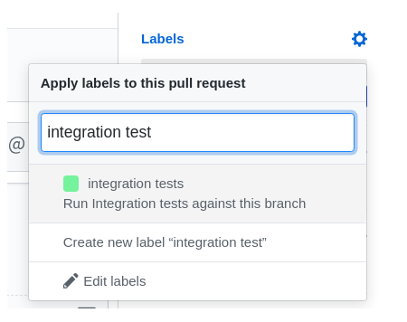
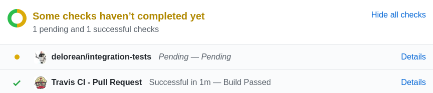

# Automated Tests

## Table of Contents
- [1. Overview](#overview)
- [2. Automated Test Pipeline](#automated-test-pipeline)
    - [2.1 OpenShift Cluster Integreatly Test Workflow](#openshift-cluster-integreatly-test-workflow)
    - [2.1 Running the Pipeline](#running-the-pipeline)
- [3. Testing GA Branches](#testing-ga-branches)
- [4. Testing RC Branches](#testing-rc-branches)

## Overview 
Delorean enables automated tests to be run when a new product release is discovered by the early warning system. These tests can be ran for all the different product release types in order to quickly catch any potential issues in new releases.

## Automated Test Pipeline
The `OpenShift Cluster Integreatly Test` pipeline provides an automated way of running tests against a PoC cluster with Integreatly installed. This pipeline is defined in the [jobs/openshift/cluster/integreatly/](../../jobs/openshift/cluster/integreatly/) directory.

### OpenShift Cluster Integreatly Test Workflow
This pipeline is split into the following stages:

1. **Cluster Create**
   
    This stage will attempt to provision a cluster first. It calls the pipeline `OpenShift Cluster Create` which provisions a PoC cluster for Integreatly to be installed against. For more information about this job, see the [creating PoC clusters](./cluster-management.md#creating-poc-clusters) documentation.

    If this stage fails, it skips stages 2-4 and immediately executes stage 5 which deprovisions the cluster to cleanup any resources this stage has created. 

2. **Install Integreatly**

    Once the PoC cluster becomes available, the job builds the pipeline `OpenShift Cluster Integreatly Install`. This pipeline installs Integreatly using a specified Git branch on the PoC cluster created in the previous step. For more information about this job, see the [installing Integreatly](./cluster-management.md#installing-integreatly) documentation.

    If this stage fails, it skips stages 2-4 and immediately executes stage 5 which deprovisions the cluster to cleanup any resources this and the previous stage has created. 

3. **Test Integreatly**

    Once the specified branch of Integreatly has been installed, the pipeline called `all-tests-executor` gets built. This job will run all the tests defined in the [jobs/integr8ly](../../jobs/integr8ly) directory against the installed Integreatly environment.

    If this stage fails, it skips the next stage and immediately executes stage 5 which deprovisions the cluster to cleanup any resources this stage and the previous stages has created. 

4. **Uninstall Integreatly**

    Once all the tests has been executed, the pipeline `OpenShift Cluster Integreatly Uninstall` gets built. This uninstalls the Integreatly environment from the provisioned PoC cluster. For more information about this pipeline, see the [deprovisionig PoC clusters](./cluster-management#uninstalling-integreatly) documentation.

5. **Deprovision Cluster**

    This stage will always get called in order to cleanup any resources the previous stages has created. It calls the pipeline `OpenShift Cluster Deprovision` which tears down the PoC cluster created in stage 1. For more information about this pipeline, see the  documentation.

### Running the Pipeline
To run this pipeline on Jenkins:
1. Go to the `OpenShift` tab
2. Select the `OpenShift Cluster Integreatly Test` pipeline
3. Build the pipeline with the following parameters

| Parameter             | Description                                                             | Required |
| --------------------- | ------------------------------------------------------------------------|:--------:|
| installationGitUrl    | Git repo URL of the Integreatly installer                               |  Y       |
| installationGitBranch | The name of the Git branch to be used for the Integreatly installation  |  Y       |
| clusterName           | Name of the cluster to test Integreatly against                         |  N       |    
| dryRun                | Will only print what the job will do                                    |  N       |     

**NOTE**:
- The `clusterName` defaults to the Git branch name if not provided.

## Testing GA Branches

Tests are not ran automatically against **GA** branches even if new changes are pushed to them. There are 2 ways of running tests against this branch:
1. Build the `OpenShift Cluster Integreatly Test` with the **GA** branch specified.
2. Add a label to the PR created by the early warning system

### Running the Pipeline Manually
In order to test **GA** branches, specify the **GA** branch to be tested (`<product-name>-ga`) as the value of the `installationGitBranch` parameter.

Follow this [guide](#running-the-pipeline) to find out how to run the pipeline manually.

### Adding a Label to the Github Pull Request
A Github pull request is created against the Integreatly installation repository on the discovery of new **GA** releases as part of the Delorean early warning system.

The label `integration tests` can be added to this Github pull request. Adding this label will trigger the build of the `OpenShift Cluster Integreatly Test` pipeline. The pull request will then be updated with the status of the build (`Pending`, `Success` or `Failed`) with a link to the job logs.

**NOTE**:
- In order to re-trigger the tests, the label will need to be removed and re-added to the pull request or the job manually re-built from Jenkins.

## Testing RC Branches
Tests are automatically ran upon the discovery of new **RC** product releases. Once any change has been pushed to the **RC** branch, it will trigger a build of the `OpenShift cluster Integreatly Test` pipeline with the **RC** branch name (`<product-name>-rc`) specified as the `installationGitBranch`.

**NOTE**:
- Any new changes pushed to this branch will re-trigger this pipeline.